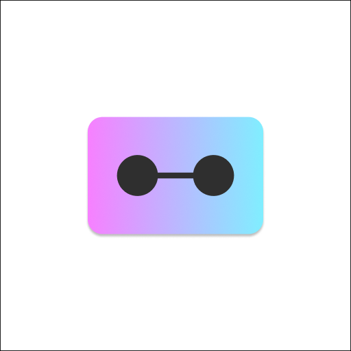

<h1 align="center">Monoplate</h2>

  

<h3 align="center">This repository provides an easy way to create projects from various templates using the npx command.</h3>

## Table of contents
- [How to use](#how-to-use)
- [Template List](#template-list)

- All features
  - Library
    - [Monoplate](./library/monoplate/README.md)
    - [Monoplate Kit](./library/monoplate-kit/README.md)
  - [Web](./web/README.md)
  - [Template](./template/README.md)

- [License](#license)

## How to use
1. Run `npx create-monoplate-app`
2. Please follow the instructions to set it up.
3. Go to project and run `npm run dev`

## Template List
The official template is easy to implement and comes pre-loaded with the necessary code for your service.

You can view all the official templates [here](https://monoplate.foscript.com/template).

## License
This project is licensed under the MIT License.

See the [LICENSE](LICENSE) file for details.
